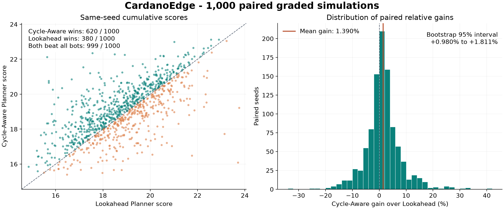
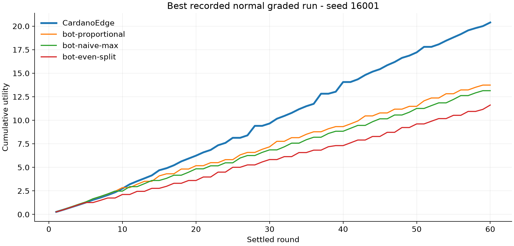
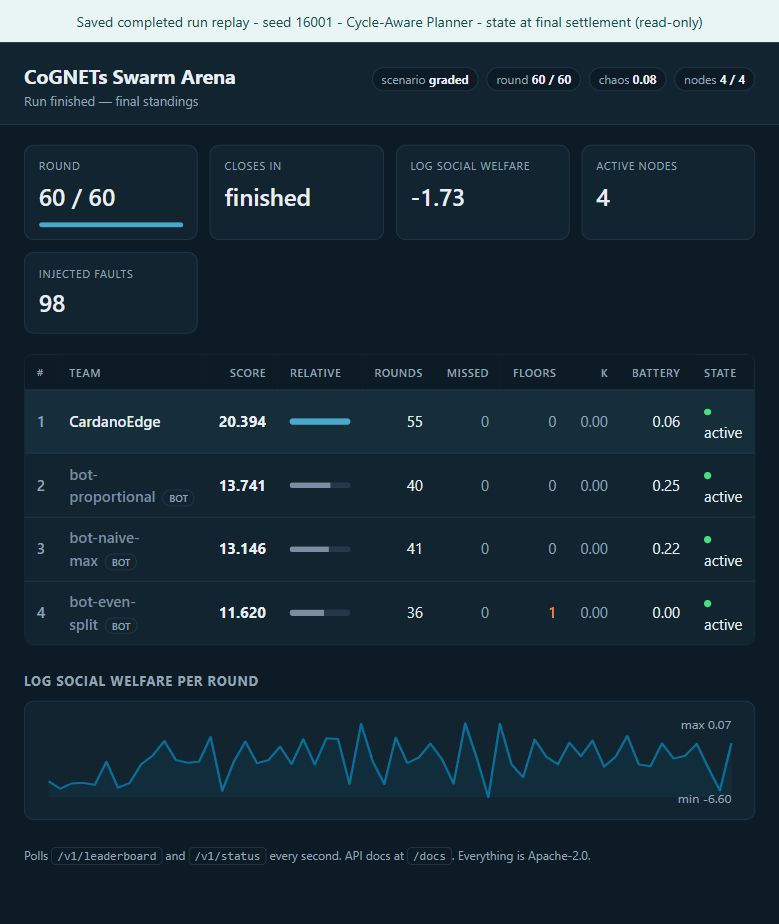

# Selection and evaluation

**Cycle-Aware Planner is the selected submission policy.** It has a measured scoring advantage over a Lookahead Planner on the supplied three-bot  field. Both agents showed comparable normal graded HTTP core behavior. Cycle-Aware costs more computation and missed more rounds in the small higher-stress test.

## Curated development experiments

This release keeps a small set of non-learned experiments that informed the design. All scores are cumulative utility per 60-round episode.

| Policy | Method | Mean score | Beat all bots | Gain vs Template | Idle / floors per run |
|---|---|---:|---:|---:|---:|
| Template | Original preference-weight bids | 13.5095 | 0/100 | - | 18.64 / 2.04 |
| Battery Taper | Cut energy as battery falls; redirect to other resources | 16.8272 | 95/100 | +25.015% | 4.40 / 0.50 |
| Market + Floors | Allocation-inverted demand and floor reserves; no battery taper | 14.7726 | 26/100 | +9.605% | 18.52 / 2.05 |
| Guarded Kelly | Numeric immediate best response, reserved floors and taper energy cap | 16.8152 | 95/100 | +24.940% | 4.37 / 0.34 |

Cohort: 100 paired graded simulator seeds **1001-1100**. Exact scores and diagnostics are in [early CSV](../evidence/early-stage-scores.csv) and [summary](../evidence/early-stage-summary.json). The important negative result was that Guarded Kelly's mean was slightly below Battery Taper. More precise one-round  allocation did not overcome the value of simple battery control. Market-aware floor bidding alone left most battery rests intact.

| Policy | Mean score | Head-to-head wins | Beat all bots | Idle / floors per run |
|---|---:|---:|---:|---:|
| Guarded Kelly | 17.1230 | 2/100 | 96/100 | 4.40 / 0.50 |
| Lookahead Planner | 19.0543 | 98/100 | 100/100 | 9.31 / 0.54 |

Separate cohort: seeds **5001-5100**. Lookahead's mean per-seed gain over Guarded Kelly was **11.686%**, approximate 95% interval **9.943-13.428%**. More rests were worthwhile when timed across the battery cycle. Evidence: [CSV](../evidence/lookahead-scores.csv), [summary](../evidence/lookahead-summary.json).

## Final paired comparison

Frozen policies, **1000 fresh paired seeds 20001-21000**, 2000 episodes, 120000 simulated rounds.

| Metric | Lookahead Planner | Cycle-Aware Planner |
|---|---:|---:|
| Mean cumulative score | 18.849185 | **19.063143** |
| Sum across 1,000 episodes | 18849.1854 | **19063.1425** |
| Median score | 18.8386 | **19.05075** |
| Head-to-head wins | 380/1000 | **620/1000** |
| Beat all three bots | 999/1000 | 999/1000 |
| First place | 999/1000 | 999/1000 |
| Score p10 / p90 | 16.8070 / 20.8365 | 17.1400 / 20.9691 |
| Minimum score | 14.8580 | 15.3936 |
| Mean participated rounds | 49.925 | 49.742 |
| Mean idle rounds | 10.075 | 10.258 |
| Mean floor violations | 0.488 | **0.327** |
| Simulated eligible misses | 0 | 0 |

There were no tied seed scores. Cycle-Aware's mean absolute advantage was **0.213957 utility**, approximate 95% interval **0.137205-0.290709**. Mean per-seed relative gain was **1.390447%**, normal interval  **0.973446-1.807449%**, paired bootstrap interval **0.979938-1.810591%** (10000 resamples, fixed analysis RNG 612101). The ratio of aggregate means is **1.135100%**; Seed win rate's Wilson 95% interval is **58.951-64.957%**.

For seed i, define `d_i = score_cycle_i - score_lookahead_i` and `g_i = 100*(score_cycle_i/score_lookahead_i - 1)`. Means and intervals above  are paired across identical seeded devices and economic draws. Price and battery trajectories differ because actions affect them. Normal intervals use `mean ± 1.96*sample_sd/sqrt(n)`; bootstrap resamples whole seed pairs.

Cycle-Aware won **163/250** disjoint four-seed groups versus **87/250** for Lookahead (no ties), pooling raw scores in consecutive seed order. This checks four-run raw-score stability, but it is not the official clipped strategy grade. The policy loses on 38% of individual seeds; its worst relative difference was -32.1815% (seed 20564).

Evidence: [paired scores](../evidence/paired-scores.csv), [analysis](../evidence/paired-analysis.json), [launch audit](../evidence/paired-audit.json).  Source hashes and historical provenance are in [provenance](../evidence/provenance.json). The release simplification was separately checked for exact decision parity.

## Computation and network latency

| Timing method | Lookahead mean / max | Cycle-Aware mean / max |
|---|---:|---:|
| Separate serial timing, 3 full episodes, seeds 17001-17003 | 29.04 / 45.93 ms | 99.25 / 162.00 ms |
| Final evaluation with 8 workers on 16 logical CPUs | 41.21 / 158.76 ms | 140.41 / 371.13 ms |
| Normal HTTP successful bid request, 4 trials | 122.3 / 266.8 ms | 136.0 / 264.7 ms |
| Higher-stress successful bid request, 2 trials | 523.4 / 992.3 ms | 533.6 / 1007.5 ms |

Serial values are averages of episode means and observed maxima on one Windows host. Parallel values include CPU contention and successive policy phases. HTTP durations are per successful POST through a recording proxy, include native delay, and **exclude** decision computation, previous retries and backoff. Eligible bid coverage below measures  whether the entire decision/retry path met the four-second windows. It would  be misleading to add independently measured means and claim a deadline guarantee.

## HTTP functional core and resilience

Historical matrix: **16 full HTTP trials**, 60 rounds at four seconds, 12-second leases and the three unchanged bots. The team traversed a recording localhost proxy; bots connected directly and retained native fault exemptions. Four independent trials ran concurrently from a clean standalone agent environment with only httpx 0.28.1 and its six dependencies. No arena or analysis dependency was installed in that agent environment.

| Condition | Seeds per policy | Native 503 / 429 | Bid delay | Additional fault |
|---|---:|---:|---|---|
| Normal graded | 22001-22004 | 8% / 4% | U(0,250 ms) | None |
| Lease outage | 22101-22102 | 8% / 4% | U(0,250 ms) | Block heartbeats **and bids** for 16 s from round 21 |
| Higher stress | 22201-22202 | 16% / 8% | U(0,1000 ms) | None |

Blocking bids matters: successful bids also renew the lease. Each outage test recorded a real native expiry, an inactive state and reactivation. After the block ended, both policies recovered **2/2** cases; maximum observed recovery was **1.20 s** for Lookahead and **1.65 s** for Cycle-Aware. Recovery was timed by external polling, including polling resolution and native faults.

| Condition | Policy | Completed / core passed | Bids / eligible | Missed | Beat all bots | Mean score |
|---|---|---:|---:|---:|---:|---:|
| Normal graded | Lookahead Planner | 4/4 | 206/207 | 1 | 4/4 | 17.1337 |
| Normal graded | Cycle-Aware Planner | 4/4 | 205/206 | 1 | 4/4 | 17.3297 |
| Lease outage | Lookahead Planner | 2/2 | 104/108 | 4 | 2/2 | 18.7881 |
| Lease outage | Cycle-Aware Planner | 2/2 | 106/108 | 2 | 2/2 | 18.4918 |
| Higher stress | Lookahead Planner | 2/2 | 101/103 | 2 | 2/2 | 18.2270 |
| Higher stress | Cycle-Aware Planner | 2/2 | 99/103 | 4 | 2/2 | 18.2807 |

Core checks require completion, registration within 30 seconds, >=95% of eligible bids, zero compromise penalties, no ejection and no early crash. All trials had zero strategy exceptions and zero proxy upstream errors.  Some proxy threads logged connection resets when keep-alive clients closed; these were not agent crashes or upstream request failures.

The standard trials split raw-score wins 2/4 each; both outage and stress split 1/2 each. HTTP seeds align profiles and economy, **not identical fault samples**: request ordering and backoff change shared fault RNG consumption. These tiny HTTP cohorts establish behavior, not a statistically strong scoring comparison. Battery rests and some inactive lease absence are classified as idle by the arena; eligible denominator is `60-idle`, as in the supplied suite. Coverage  alone can conceal lease downtime, hence the explicit expiry/recovery evidence.

### Per-trial results

| Condition | Seed | Policy | Score | Bids / eligible | Missed | Agent-facing 503 / 429 | Expiries | Recovery after release |
|---|---:|---|---:|---:|---:|---|---:|---|
| graded | 22001 | Lookahead Planner | 18.2902 | 54/54 | 0 | 61 / 34 | 0 | - |
| graded | 22001 | Cycle-Aware Planner | 17.7693 | 55/55 | 0 | 63 / 32 | 0 | - |
| graded | 22002 | Lookahead Planner | 17.1027 | 46/46 | 0 | 57 / 36 | 0 | - |
| graded | 22002 | Cycle-Aware Planner | 18.0376 | 45/45 | 0 | 53 / 38 | 0 | - |
| graded | 22003 | Lookahead Planner | 17.0184 | 54/55 | 1 | 58 / 29 | 0 | - |
| graded | 22003 | Cycle-Aware Planner | 16.8619 | 54/55 | 1 | 60 / 34 | 0 | - |
| graded | 22004 | Lookahead Planner | 16.1235 | 52/52 | 0 | 63 / 29 | 0 | - |
| graded | 22004 | Cycle-Aware Planner | 16.6501 | 51/51 | 0 | 69 / 32 | 0 | - |
| lease-outage | 22101 | Lookahead Planner | 17.6078 | 54/56 | 2 | 83 / 30 | 1 | 1.20 s |
| lease-outage | 22101 | Cycle-Aware Planner | 17.7643 | 55/56 | 1 | 81 / 30 | 1 | 1.16 s |
| lease-outage | 22102 | Lookahead Planner | 19.9684 | 50/52 | 2 | 85 / 21 | 1 | 0.17 s |
| lease-outage | 22102 | Cycle-Aware Planner | 19.2194 | 51/52 | 1 | 88 / 18 | 1 | 1.65 s |
| stress | 22201 | Lookahead Planner | 18.6335 | 51/52 | 1 | 90 / 47 | 0 | - |
| stress | 22201 | Cycle-Aware Planner | 18.2711 | 49/51 | 2 | 89 / 46 | 0 | - |
| stress | 22202 | Lookahead Planner | 17.8205 | 50/51 | 1 | 99 / 45 | 0 | - |
| stress | 22202 | Cycle-Aware Planner | 18.2902 | 50/52 | 2 | 95 / 48 | 0 | - |

All underlying derived trial fields, native fault counters, recovery times,  request-duration means/p95/max and scores are preserved in [HTTP assessment](../evidence/http-assessment.json). Synthetic outage 503s are counted separately as `outage_blocked_requests`. Standard largest per-trial successful-request p95 was 247.5 ms for Lookahead and 254.8 ms for Cycle-Aware.

## Relation to the five scoring components

The supplied introductionallocates 30/20/25/15/10 points:

| Component | Evidence |
|---|---|
| Functional core - 30 | Standard full HTTP core passes 4/4 for each policy; clean native conformance and release run |
| Resilience - 20 | Native 503/429, actual latency, battery rests, real lease expiry/recovery and retry/backoff |
| Strategy/performance - 25 | Frozen 1,000-seed paired scores and four-run raw pools | 
| Engineering - 15 | Environment configuration, small standalone runtime, readable method, useful logs and accurate evidence 
| Insight/presentation - 10 | Negative results, score/cycle analysis and swarm tradeoff documented |

The strategy formula is

$P_S=25\operatorname{clip}\left(\frac{S-T}{R-T},0,1\right),$

where T and R replay the template and organizer reference on **our device and  seed**, with scoring pooled over four runs. We cannot infer exact points from raw-score wins or replace R with Lookahead. If both policies exceed the cap, their official strategy points can tie despite different cumulative utility.

The supplied native conformance suite previously reported 8/8 checks for both policies, with 8/8 eligible bids, zero misses and 28 faults (seed 22301, 15 three-second rounds, chaos .12): indicative **30/30 functional and 20/20 resilience**. This one-agent market exercises the shared guarded fallback; the full four-agent trials exercise planning. A release-specific suite run is recorded in [release validation](release-validation.md).

Applying the suite's **local** formulas to each full HTTP trial and averaging produces the following indications, not official grade predictions:

| Condition | Lookahead functional /30 | Cycle-Aware functional /30 | Lookahead resilience /20 | Cycle-Aware resilience /20 |
|---|---:|---:|---:|---:|
| Normal graded | 29.86 | 29.86 | 18.75 | 18.75 |
| Lease outage | 28.89 | 29.44 | 15.00 | 15.00 |
| Higher stress | 29.42 | 28.83 | 15.00 | 15.00 |

Functional uses `30*eligible_coverage` on a completed run. The suite's resilience weights are 8/5/4/3 for fault survival, lease-health proxy, inadmissibility survival and shutdown. Its five-point lease proxy requires **zero missed rounds**, so one late bid can lose those points without an actual expiry. Despite its `forced_expiry_done` variable, the suite does not inject genuine expiry; our renewal-block test supplies that missing evidence.

## Swarm costs and limitations

Across the final 1000 seeds, Cycle-Aware changed the three neighbors' combined score by **-0.059361** and the sum of round log social welfare by **-0.073510** relative to Lookahead. Own-score gains need not improve swarm outcomes.
[Paired swarm CSV](../evidence/paired-swarm.csv) retains both policies' metrics.

### With and without our bidder

A release-stage bot-only counterfactual replayed the same **1000 seeds** with the original three bots and no CardanoEdge registration. It uses the arena simulator, identical bot profiles and per-round capacities/wallets, and the same empty-history bot behavior. Actions, prices and batteries naturally change when the fourth bidder is absent. No parameters were adjusted afterward.

| Mean across 1,000 seeds | Three bots only | With Lookahead Planner | With Cycle-Aware Planner |
|---|---:|---:|---:|
| Three bots' combined cumulative score | 59.875769 | 38.028633 | 37.969273 |
| Sum of round log social welfare | -75.542406 | -199.012208 | -199.085718 |

Adding Cycle-Aware reduced neighbors' combined score by **21.906496** on average versus the bot-only field. This is a substantial redistribution of scarce shares, not a claim of improved collective welfare. LSW also changes the number of logged participating utilities between the three- and four-node populations, so its **-123.543313** change must not be interpreted as a population-independent welfare effect. The Cycle-Aware-versus-Lookahead comparison keeps the same four nodes and is the cleaner marginal strategy comparison.

The bot-only calculation was performed while packaging the release; the four-agent columns use the frozen historical episodes. Exact per-seed fields and input hash: [counterfactual CSV](../evidence/swarm-counterfactual/scores.csv),
[summary](../evidence/swarm-counterfactual/summary.json). Reproduce with
`python experiments/swarm_counterfactual.py`.

### Best retained graded run

The fresh release trial on seed **16001** completed **60 rounds at four seconds** with normal graded faults, **20.3936** utility, first place, **55/55 eligible bids**, five battery rests, zero misses, zero floor violations and zero compromise. It surpassed the previously retained normal graded export (19.1667 on the same seed). The arena recorded **63 injected 503s and 35 injected 429s**; these are whole-arena counters, not a per-agent fault count. Final competing scores were 13.7409 (proportional), 13.1459 (naive-max) and 11.6198 (even-split).

The screenshot displays a **labeled read-only replay** of [the actual release results](../evidence/best-run/results.json) on the original dashboard. It preserves completion-state batteries, faults and active flags. After completed clients stop, a still-running live arena eventually marks the team lease expired; that post-run event does not describe its grading behavior. The launcher's settled export is authoritative: the inherited agent's final log can precede the last settlement because its fixed three-second wait is shorter than a four-second round.
